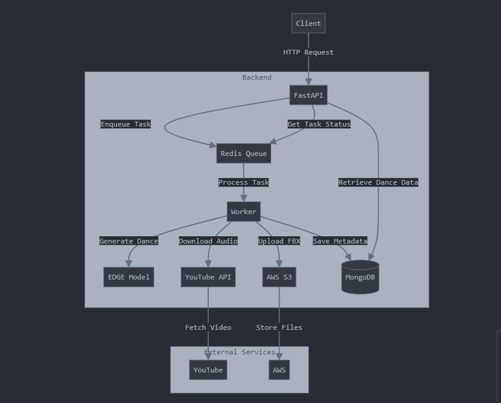

# DanceGen

DanceGen is an AI-powered dance generation API that creates dance animations based on music input. It leverages the EDGE (Editable Dance Generation) model to produce unique dance sequences synchronized with given songs.
Please go to [EDGE](https://github.com/Stanford-TML/EDGE) and make sure that you have the pre requisites and your device meets the project's GPU requirements before running the project

## Watch user generated dances
As I have rented GPU VM, I have stopped the VM and now only available the dance s that were been generated in August during the launch.
[Generated Dances](https://bile-front-v1.vercel.app/en/all-dances))
## Front end
[BileAI front end](https://github.com/youngccame1/bile-ai-3d)

## Features

- Generate dance animations from song names or audio files
- Asynchronous processing for efficient handling of multiple requests
- Integration with YouTube for audio retrieval
- Storage of generated dance animations in AWS S3
- Metadata storage in MongoDB for easy retrieval and management

## Architecture

The DanceGen project consists of the following main components:

- FastAPI backend for handling HTTP requests
- Redis Queue for task management
- EDGE model for dance generation
- YouTube API integration for audio retrieval
- AWS S3 for storage of generated FBX files
- MongoDB for metadata storage


## Prerequisites

- Docker and Docker Compose
- AWS account with S3 access
- YouTube API credentials

## Installation and Setup

1. Clone the repository:
   ```
   git clone https://github.com/youngccame1/bile-ai-backend.git
   cd bile-ai-backend
   ```

2. Create a `.env` file in the root directory with the following variables:
   ```
   YOUTUBE_API_KEY=your_youtube_api_key
   MONGODB_URI=your_mongodb_connection_string
   REDIS_URL=redis://redis:6379
   AWS_ACCESS_KEY_ID=your_aws_access_key
   AWS_SECRET_ACCESS_KEY=your_aws_secret_key
   S3_BUCKET_NAME=your_s3_bucket_name
   ```

3. Build and run the Docker containers:
   ```
   docker-compose up --build
   ```

This will start the FastAPI server, Redis, and a worker to process the queue.

## Usage

The API will be available at `http://localhost:8000`.

To generate a dance animation, send a POST request to the `/api/v1/generate_dance` endpoint:

```python
import requests

response = requests.post(
    "http://localhost:8000/api/v1/generate_dance",
    json={"song_name": "Billie Jean"}
)

task_id = response.json()["task_id"]
```

You can then check the status of the task and retrieve the result using the task ID.
## FBX Environment
If you need an AutoDesk FBX environment for other project you can pull the image from DockerHub which allows you to work with Python FBX without installing it manually.
```
docker pull youngccamel/bile:fbx2
```
## .pkl to .fbx file converter API
[Converter](https://fbx-1-f0e6e5cdebetdnfy.eastus-01.azurewebsites.net/docs)
## API Documentation

Once the server is running, you can access the API documentation at `http://localhost:8000/docs`.

## Docker Configuration

The project uses Docker for containerization. Here's an overview of the Docker setup:

### Dockerfile

The `Dockerfile` in the root directory defines the main application container. It:

1. Uses Python 3.9 as the base image
2. Installs system dependencies (git, ffmpeg, libsm6, libxext6)
3. Clones the EDGE repository
4. Installs Python dependencies from `requirements.txt`
5. Copies the application code
6. Sets the command to run the FastAPI server

### docker-compose.yml

We use Docker Compose to define and run multi-container Docker applications. Create a `docker-compose.yml` file in the root directory with the following content:

```yaml
version: '3.8'

services:
  web:
    build: .
    ports:
      - "8000:8000"
    env_file:
      - .env
    depends_on:
      - redis
      - mongodb

  worker:
    build: .
    command: rq worker
    env_file:
      - .env
    depends_on:
      - redis
      - mongodb

  redis:
    image: "redis:alpine"

  mongodb:
    image: "mongo:4.4"
    volumes:
      - mongodb_data:/data/db

volumes:
  mongodb_data:
```

This Docker Compose file defines four services:
1. `web`: The main FastAPI application
2. `worker`: An RQ worker to process background tasks
3. `redis`: Redis server for task queue
4. `mongodb`: MongoDB database for storing metadata

## Contributing

Contributions to DanceGen are welcome! Please refer to our [Contributing Guidelines](CONTRIBUTING.md) for more information.

## License

This project is licensed under the MIT License. See the [LICENSE](LICENSE) file for details.

## Acknowledgements

- [EDGE: Embodied Dance Generation](https://github.com/Stanford-TML/EDGE)
- [FastAPI](https://fastapi.tiangolo.com/)
- [Redis Queue](https://python-rq.org/)

For any questions or support, please open an issue on the GitHub repository.
